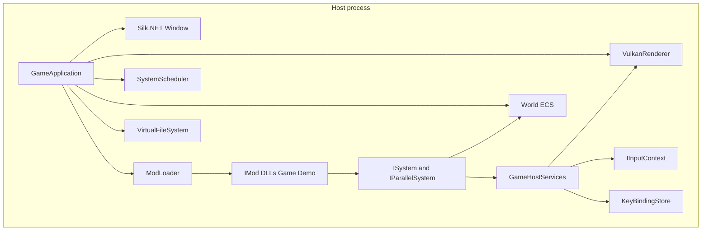

# Cyberland

Cyberland is a **cyberpunk 2D single-player RPG** built in C# on **.NET 8**. The codebase separates a reusable **engine**, a thin **host** executable, and **gameplay delivered as mods** (including the shipped base game). Rendering uses **Vulkan** (via Silk.NET); audio uses **OpenAL**.

Design goals: **small footprint**, **predictable load**, and **scaling from integrated GPUs to modern hardware**—see `.cursor/rules/cyberland-design-goals.mdc` for detail.

---

## Requirements

| Requirement | Notes |
|-------------|--------|
| **.NET 8 SDK** | Required to build and run. |
| **Vulkan 1.x + a working driver** | The host runs a **2D HDR** pipeline (deferred lighting, bloom, composite to the swapchain). Init failures surface via **`UserMessageDialog`** / **`GraphicsInitializationException`** instead of crashing silently. |
| **Windows** | Primary target; input and error UI are written with that in mind (other platforms may work where Silk.NET + Vulkan do). |

---

## Quick start

From the repository root:

```powershell
dotnet build Cyberland.sln -c Debug
dotnet run --project src/Cyberland.Host/Cyberland.Host.csproj -c Debug
```

Or run via script:

```powershell
.\scripts\Run-Cyberland.ps1
.\scripts\Run-Cyberland.ps1 -Watch   # dotnet watch run
```

If PowerShell reports that the script **is not digitally signed** (often in an **elevated** shell with a strict policy), use the matching **`.cmd`** wrapper instead—it runs the same script with `-ExecutionPolicy Bypass`: `.\scripts\Run-Cyberland.cmd`, `.\scripts\Publish-Cyberland.cmd`, `.\scripts\Sync-CyberlandAssets.cmd`, `.\scripts\Clear-CyberlandArtifacts.cmd`, `.\scripts\Setup-GitHooks.cmd`. Alternatively: `Set-ExecutionPolicy -ExecutionPolicy RemoteSigned -Scope CurrentUser` (applies only to your user), or a one-off `powershell -NoProfile -ExecutionPolicy Bypass -File .\scripts\Run-Cyberland.ps1`.

**Visual Studio Code / Cursor:** default build task builds the solution; **Run** / **Watch** tasks run the host; launch configuration **Cyberland.Host** debugs under **`artifacts/bin/Cyberland.Host/debug/`** so `Mods/` resolves next to the executable.

**Finding Run / Publish:** Names like **Cyberland: Run** are **workspace tasks**, not standalone Command Palette commands—you will not see them when you only open the palette and search for “Cyberland” or “Publish”. Open the repo **folder** (the directory that contains `Cyberland.sln` and `.vscode/tasks.json`), then use **Command Palette** → **Tasks: Run Task** (or **Terminal → Run Task…**), and pick the task from the list. You can type `task` in the palette to jump to **Tasks: Run Task** quickly.

Open the **Command Palette** (`Ctrl+Shift+P`) → **Tasks: Run Task** → pick a **Cyberland:** task (same commands as the Cursor skills):

| Task | Action |
|------|--------|
| **Cyberland: Run** | `dotnet run` the host (Debug) — *run-cyberland* skill |
| **Cyberland: Test Engine** | Engine tests with coverlet — *test-cyberland-engine* skill |
| **Cyberland: Publish Release** | `dotnet publish` + copy `Mods/` into publish output — *publish-cyberland* skill (see `scripts/Publish-Cyberland.ps1`) |
| **Cyberland: Clear Artifacts** | Delete repo-root `artifacts/` — *clear-cyberland-artifacts* skill (see `scripts/Clear-CyberlandArtifacts.ps1`) |

---

## Asset setup (GitHub Releases)

Large game media does not live in git. Asset bundles are published in GitHub Releases and mapped by per-mod manifests:

- `mods/Cyberland.Game/content.release.manifest.json`
- `mods/Cyberland.Demo/content.release.manifest.json`

Each bundle is tied to one mod and extracts into that mod's `Content/` folder:

- `mods/Cyberland.Game/Content/`
- `mods/Cyberland.Demo/Content/`

From repository root:

```powershell
.\scripts\Sync-CyberlandAssets.ps1
```

The script discovers each mod manifest, downloads release archives, verifies SHA256, and extracts to the mod-owned content folders above.

### Git hook setup (recommended)

This repo includes a pre-commit hook that blocks staged files larger than 4 MiB by default.

```powershell
.\scripts\Setup-GitHooks.ps1
```

Override options for exceptional cases:

- One-off bypass: `git commit --no-verify`
- Maintainer local override: `CYBERLAND_ALLOW_LARGE_FILES=1 git commit ...`
- Temporary threshold override: `CYBERLAND_MAX_FILE_MB=8 git commit ...`

If you bypass, follow up by moving large media into the GitHub Releases asset flow.

### Build output (`artifacts/`)

The solution uses **.NET 8 [artifacts output layout](https://learn.microsoft.com/en-us/dotnet/core/sdk/artifacts-output)** (`UseArtifactsOutput` + `ArtifactsPath` in **`Directory.Build.props`**). **All** compiled output, intermediates, and **`dotnet publish`** output go under **`artifacts/`** at the repo root—**not** into `bin/` / `obj/` next to each `.csproj`.

| Path | Contents |
|------|----------|
| **`artifacts/bin/<ProjectName>/debug/`** or **`.../release/`** | Built assemblies and deps (e.g. **`artifacts/bin/Cyberland.Host/debug/Cyberland.Host.exe`**). Mod staging runs on **build** and places **`Mods/`** here next to the host. |
| **`artifacts/obj/...`** | MSBuild intermediate files per project. |
| **`artifacts/publish/<ProjectName>/debug/`** or **`.../release/`** | **`dotnet publish`** output for that project (e.g. **`Cyberland.Host.exe`** and dependencies). **`Mods/`** is not copied here automatically; see [Clean build and packaging](#clean-build-and-packaging) below. |

After **Cyberland.Host** builds, mods are **staged** next to the host executable under `Mods/`:

| Folder | Contents |
|--------|----------|
| **`Mods/Cyberland.Game/`** | Base campaign mod: `Cyberland.Game.dll`, `manifest.json`, `Content/` (synced from release bundles). **Enabled** by default (`manifest.json` has no **`disabled`** flag). |
| **`Mods/Cyberland.Demo/`** | 2D HDR deferred sprite + ECS sample. **`disabled`: `true`** in `manifest.json` by default — see [Enabling a demo mod for testing](#enabling-a-demo-mod-for-testing). |
| **`Mods/Cyberland.Demo.Pong/`**, **`...Snake/`**, **`...BrickBreaker/`** | Arcade samples; **`disabled`: `true`** by default. |

`Cyberland.Host.csproj` copies these on build. Demo mods stay in the tree for development but do not load until you opt in (edit the staged **`manifest.json`** or the copy under **`mods/`** and rebuild).

### Clean build and packaging

Use this when you want a **fresh tree** or a **folder you can zip** and run elsewhere (framework-dependent builds still need the **.NET 8** runtime on the target machine unless you publish self-contained).

1. **Optional — wipe build outputs** (close any running **`Cyberland.Host.exe`** first):

   ```powershell
   if (Test-Path artifacts) { Remove-Item -Recurse -Force artifacts }
   ```

2. **Publish Release** from the repository root:

   ```powershell
   dotnet publish src/Cyberland.Host/Cyberland.Host.csproj -c Release
   ```

   Output: **`artifacts/publish/Cyberland.Host/release/`** (executable + dependencies).

3. **Sync mod media assets** (if not already synced):

   ```powershell
   .\scripts\Sync-CyberlandAssets.ps1
   ```

4. **Stage mods into the publish folder.** Staging targets run **`AfterTargets="Build"`**, so **`Mods/`** lands under **`artifacts/bin/Cyberland.Host/release/`**, not automatically under **`publish/`**. Copy it beside the published exe:

   ```powershell
   Copy-Item -Recurse -Force "artifacts/bin/Cyberland.Host/release/Mods" "artifacts/publish/Cyberland.Host/release/"
   ```

5. **Package** — archive **`artifacts/publish/Cyberland.Host/release/`** (e.g. zip that folder). **`keybindings.json`** is created at runtime next to the exe if missing.

**Self-contained** (larger, no shared runtime on the target), example for Windows x64:

```powershell
dotnet publish src/Cyberland.Host/Cyberland.Host.csproj -c Release -r win-x64 --self-contained true
Copy-Item -Recurse -Force "artifacts/bin/Cyberland.Host/release/Mods" "artifacts/publish/Cyberland.Host/release/"
```

Project-specific notes for agents live in **`.cursor/skills/publish-cyberland/`** and **`.cursor/skills/clear-cyberland-artifacts/`**.

---

## Testing (engine)

The **`Cyberland.Engine.Tests`** project targets **`Cyberland.Engine`** only (not the host, mods, or GPU paths). It enforces **100% line coverage** on that assembly via **coverlet**.

GitHub Actions runs this automatically in the **`Engine Tests`** workflow for pull requests and pushes to `main` when engine test-related files change (plus manual `workflow_dispatch`).

```powershell
dotnet test tests/Cyberland.Engine.Tests/Cyberland.Engine.Tests.csproj -c Debug /p:CollectCoverage=true
```

Use the command above for local feedback before pushing. CI remains the merge gate for engine coverage.

Coverage outputs **`coverage.cobertura.xml`** next to the test project output (ignored by git).

Types that require a real **window**, **Vulkan**, **OpenAL**, or **Win32 MessageBox** are marked **`[ExcludeFromCodeCoverage]`** (`VulkanRenderer`, `GameApplication`, `OpenALAudioDevice`, parts of `GlslSpirvCompiler`, `UserMessageDialog.ShowError`). When you change those, add or extend **manual / integration** checks; keep pure logic testable in isolation.

---

## Repository layout

```
Cyberland.sln
Directory.Build.props          # Shared SDK, language settings, artifacts output root
artifacts/                     # Build outputs (gitignored): bin/, obj/, publish/
tests/
  Cyberland.Engine.Tests/      # xUnit + coverlet (100% line coverage on Cyberland.Engine)
  Cyberland.TestMod/           # Minimal IMod assembly used by ModLoader tests
src/
  Cyberland.Host/              # Executable: references Engine + staged mods (build)
  Cyberland.Engine/            # Engine library (ECS, Vulkan, input, mods, assets, …)
mods/
  Cyberland.Game/              # Base campaign mod (IMod, locale Content/)
  Cyberland.Demo/              # Sample mod (manifest disabled by default; see README)
  Cyberland.Demo.Pong/ …       # Arcade demos (same)
scripts/
  Run-Cyberland.ps1
  Publish-Cyberland.ps1
  Clear-CyberlandArtifacts.ps1
.vscode/
  tasks.json, launch.json
.cursor/rules/                 # Optional agent / team conventions
```

| Project | Role |
|---------|------|
| **Cyberland.Host** | Entry point (`Program.cs` → `GameApplication`). Builds and stages **`Cyberland.Game`**, **`Cyberland.Demo`**, and arcade demo mods into `$(OutDir)Mods/`. |
| **Cyberland.Engine** | All shared runtime: windowing, Vulkan renderer, ECS, task scheduler, virtual FS, assets, localization, OpenAL, mod loader, `GameHostServices`. |
| **Cyberland.Game** | Base campaign mod → `Cyberland.Game.dll` (locale and future core data). Loaded by default. |
| **Cyberland.Demo** (and **Pong** / **Snake** / **BrickBreaker**) | Sample mods → respective DLLs. **`disabled`: `true`** in each **`manifest.json`** by default so normal runs load only the base game. |

---

## High-level architecture



1. **Host** creates the window, graphics, input, keybindings, ECS world, scheduler, and VFS, then calls **`ModLoader.LoadAll`** on `AppContext.BaseDirectory/Mods`.
2. Each mod’s **`IMod.OnLoad`** receives a **`ModLoadContext`**: world, scheduler, localization, VFS, and **`Host`** (`GameHostServices`).
3. Mods **register systems** on the scheduler and optionally spawn entities, mount extra paths, etc.
4. Every frame, **`GameApplication`** runs **`SystemScheduler.RunFrame(world, dt)`**, which **walks a single ordered list** of registrations (each entry is either **`ISystem`** or **`IParallelSystem`**, in the order they were registered), then handles **host-only** input (e.g. Escape → exit), and **presents** the swapchain.

**Rule of thumb:** *If it is gameplay, it belongs in a mod (or a new mod assembly), not in `GameApplication`.*

**Default engine systems (2D):** The host registers systems in a fixed **explicit order**: parallel **transform hierarchy**, **sprite animation**, and **CPU particle simulation**; then **`ModLoader.LoadAll`** (mods append **`RegisterSequential`** / **`RegisterParallel`** in manifest order); then parallel **tilemap**, **sprite**, and **particle** submit systems. After **`VulkanRenderer`** initialization, **`GameApplication`** applies baseline HDR globals once via **`EngineDefaultGlobalPostProcess.Apply`** (not every frame). Mods replace or extend those settings by calling **`SetGlobalPostProcess`** from **`IMod.OnLoad`** (later loads win over earlier ones) or from a system when values must track the frame (e.g. volumes tied to **`SwapchainPixelSize`**).

---

## Engine subsystems (Cyberland.Engine)

### ECS (`Core/Ecs`)

- **`World`** — entity creation/destruction; owns an **archetype graph** (entities with the same component *signature* share fixed-size **chunks** with SoA columns for cache-friendly iteration).
- **`Components<T>()`** / **`ComponentStore<T>`** — **`GetOrAdd`**, **`TryGet`**, **`Get`**, **`Remove`**, **`Contains`** for entity-scoped access.
- **`QueryChunks<T>()`** / **`QueryChunks<T0, T1>()`** — foreach over **chunks**; each yields contiguous **`Span<T>`** columns (and matching **`EntityId`** rows) for SIMD-friendly inner loops. Helpers such as **`SimdFloat`** operate on those spans.
- **`EntityId`** — opaque id from **`EntityRegistry`**.

Components are **`struct`** types; define them in your mod assembly (see `Velocity` in **`Cyberland.Demo`**).

### Task scheduler (`Core/Tasks`)

- **`SystemScheduler`** — one ordered list of **`RegisterSequential`** / **`RegisterParallel`** calls. **`RunFrame`** walks entries in registration order. Each enabled entry runs **`ISystem.OnStart`** / **`IParallelSystem.OnStart`** at most **once** per registration (first frame the entry is enabled), then **`ISystem.OnUpdate`** or **`IParallelSystem.OnParallelUpdate`** (with **`ParallelOptions`** from **`ParallelismSettings`**). Disabled entries are skipped entirely until **`SetEnabled(logicalId, true)`**; re-enabling does **not** run **`OnStart`** again. Replacing a logical id resets lifecycle so the new instance gets **`OnStart`** once. **`SetEnabled`**, **`SystemStarted`**, **`SystemEnabled`**, **`SystemDisabled`**, and **`SystemUnregistered`** (from **`TryUnregister`**) are the hooks for introspection and debugging.
- **`ParallelismSettings.MaxConcurrency`** — `0` means use all logical processors.

Frame order is **registration order** (not separate global “sequential phase” vs “parallel phase”). The host registers engine systems first, mods append during **`LoadAll`**, then the host appends render submit systems—so a mod’s systems run **between** simulation and drawing **when** they register during **`OnLoad`**.

### Rendering (`Rendering/`)

- **`IRenderer`** (implemented by **`VulkanRenderer`**) — mod-facing API: **`SubmitSprite`**, **`SubmitPointLight`**, **`SubmitSpotLight`**, **`SubmitDirectionalLight`**, **`SubmitAmbientLight`**, **`SubmitPostProcessVolume`**, **`SetGlobalPostProcess`**, **`RegisterTextureRgba`**, **`RequestClose`**, plus **`SwapchainPixelSize`**. **CPU-side** submit queues are **thread-safe** for **`IParallelSystem`** workers; GPU command recording and **`DrawFrame`** stay on the render thread.
- **HDR frame pipeline (scene-linear offscreen targets, tonemap in composite):** emissive prepass (optional per-texel **`EmissiveTextureId`**) → **G-buffer** (opaque sprites only) → **HDR**: fullscreen base lighting (ambient / directional / spot) + **all** submitted **point lights** (instanced draw, SSBO) + emissive bleed → **weighted blended OIT** for **transparent** sprites → resolve to HDR → **bloom** → **composite** to the swapchain. Sort order for sprites is **layer → sort key → depth hint**; **straight alpha** where applicable. See **`.cursor/rules/cyberland-design-goals.mdc`** for linear-color and modularity goals.
- **Opaque vs transparent:** set **`SpriteDrawRequest.Transparent`** / **`Sprite.Transparent`** for glass-style draws (WBOIT over opaque HDR); otherwise the sprite goes through the deferred G-buffer path.
- **`WorldScreenSpace`** — **world** (origin bottom-left, +Y up) vs **framebuffer** (top-left, +Y down). The renderer applies **`WorldCenterToScreenPixel`** to sprite centers—keep gameplay in world space rather than duplicating conversions.

### Input (`Input/`)

- **`KeyBindingStore`** — maps action ids (`move_up`, `move_left`, …) to **`Silk.NET.Input.Key`**, loaded from `keybindings.json` under the app base directory.

### Assets (`Assets/`)

- **`VirtualFileSystem`** — ordered mount points; **later mounts override earlier** (mod content over base). **`BlockPath`** hides a relative path globally (even if an earlier mount had the file).
- **`AssetManager`** — async **`LoadBytesAsync`**, **`LoadTextAsync`**, **`LoadJsonAsync`**, streaming **`OpenReadOrThrow`**.

### Localization (`Localization/`)

- **`LocalizationManager`** — merged key → string tables (JSON), culture fallback; **`TryRemoveKey`** / **`RemoveKey`** drop keys for later mods.
- Mods merge strings through the load pipeline / your own loads as needed.

### Audio (`Audio/`)

- **`OpenALAudioDevice`** — optional; host continues without audio if OpenAL is missing.

### Modding (`Modding/`)

- **`IMod`** — **`OnLoad(ModLoadContext)`**, **`OnUnload()`**.
- **`ModManifest`** — id, version, **`entryAssembly`**, **`contentRoot`**, **`loadOrder`**, optional **`disabled`**, optional **`contentBlocklist`** (see `manifest.json`).
- **`ModLoader`** — discovers `Mods/*/manifest.json`, skips mods with **`disabled`**: **`true`** or ids listed in the optional **CLI exclude set**, mounts remaining content (then applies each mod’s blocklist), loads **`entryAssembly`**, finds one concrete **`IMod`**, invokes **`OnLoad`**.

### Hosting (`Hosting/`)

- **`GameHostServices`** — **`KeyBindings`**, **`Renderer`** (**`IRenderer?`**; concrete type **`VulkanRenderer`**), **`Input`** (**`IInputContext?`**), optional **`Tilemaps`** (**`ITilemapDataStore?`**) and **`Particles`** (**`ParticleStore?`**) for tile indices and CPU particle buffers used by engine render/sim systems. Populated by **`GameApplication`** after the window and device exist, then passed into **`ModLoadContext`** so mods do not use static globals.

### Scene (`Scene/`)

- **Components** — **`Position`**, **`Rotation`**, **`Scale`**, **`Transform`** (local TRS + optional parent), **`Sprite`** (includes **`Transparent`** for WBOIT vs deferred opaque path; optional **`EmissiveTextureId`**), **`Tilemap`**, **`SpriteAnimation`**, **`ParticleEmitter`**.
- **Stores** — **`TilemapDataStore`** / **`ITilemapDataStore`**, **`ParticleStore`** (indexed by entity; not stored inside ECS chunks).
- **Systems** (registered by the host; see frame order above) — **`TransformHierarchySystem`**, **`SpriteAnimationSystem`**, **`ParticleSimulationSystem`**, **`TilemapRenderSystem`**, **`SpriteRenderSystem`**, **`ParticleRenderSystem`**. Baseline global post lives in **`EngineDefaultGlobalPostProcess`** (applied at init, not as a system).

Mods typically attach **`Sprite`** + **`Position`** (and optional rotation/scale) and let **`SpriteRenderSystem`** build **`SpriteDrawRequest`** (copying **`Transparent`**, texture ids, etc.) and call **`SubmitSprite`**, instead of issuing draws manually.

---

## Mod system (convention)

### Folder layout on disk

```
Mods/
  Cyberland.Game/         # loadOrder 0 — locale, future core assets
  Cyberland.Demo/         # loadOrder 10 — 2D sample (disabled by default in manifest)
  Cyberland.Demo.Pong/    # arcade demos (disabled by default)
  Cyberland.Demo.Snake/
  Cyberland.Demo.BrickBreaker/
    manifest.json
    *.dll
    Content/                # mounted to VFS (last mod wins for same path)
```

### Enabling a demo mod for testing

Shipped **demo** mods (**`Cyberland.Demo`**, **Pong**, **Snake**, **BrickBreaker**) have **`"disabled": true`** in their **`mods/<...>/manifest.json`** so a normal **`dotnet run`** loads only **`cyberland.base`**.

1. **Turn on one demo** — In the repo, open that mod’s **`manifest.json`** and set **`"disabled": false`** (or remove the **`disabled`** property). Rebuild so the updated manifest is copied into **`artifacts/bin/Cyberland.Host/.../Mods/`** (staging runs after build). Alternatively, edit **`manifest.json`** next to the host exe under **`Mods/<ModName>/`** if you are iterating without rebuilding.
2. **Skip the base game** — The base mod’s id is **`cyberland.base`**. Pass **`--exclude-mods`** so only your demo runs:

   ```powershell
   dotnet run --project src/Cyberland.Host/Cyberland.Host.csproj -c Debug -- --exclude-mods cyberland.base
   ```

   Add other ids to the comma-separated list if you temporarily enable multiple mods and want to exclude some of them.

3. **Sync assets** — Demo **`Content/`** may still need **`.\scripts\Sync-CyberlandAssets.ps1`** (see [Asset setup](#asset-setup-github-releases)).

### `manifest.json`

Example (see `mods/Cyberland.Game/manifest.json`):

- **`id`** — stable string id.
- **`entryAssembly`** — DLL name containing an **`IMod`** implementation.
- **`contentRoot`** — relative folder mounted for this mod (often `Content`).
- **`loadOrder`** — lower runs earlier (manifests sorted by load order, then id).
- **`disabled`** (optional) — when **`true`**, the loader ignores the mod: no content mount, no blocklist, no assembly load (default **`false`**).
- **`contentBlocklist`** (optional) — array of virtual relative paths to hide after this mod’s content is mounted (blocks win over all mounts; use normal file overrides when you want to replace content instead).

### `IMod` implementation

- Ship a **public non-abstract class** implementing **`IMod`** (the loader picks the first exported type assignable to **`IMod`**).
- **`manifest.json`** is the source of truth for id, name, version, **`entryAssembly`**, **`contentRoot`**, **`loadOrder`**, etc.; **`ModLoadContext.Manifest`** in **`OnLoad`** is that deserialized data (do not duplicate it in the **`IMod`** type).
- **`OnLoad`**: register systems (with stable **logical ids**), spawn entities, merge localization, call **`context.MountDefaultContent()`** if you rely on `Content/` under the mod folder.

### Systems: ids, extend, replace, remove

Every ECS system is registered with a **non-empty logical id** (convention: `"<modId>/<purpose>"`, e.g. `cyberland.demo/sprite-move`). Mods load in **`loadOrder`** order; a later mod can:

- **Extend** — register **new** ids.
- **Replace** — call **`RegisterSequential`** / **`RegisterParallel`** again with an id already used; the implementation is swapped **in place** (frame order among other systems stays the same).
- **Remove** — **`TryUnregister(logicalId)`** drops that system from the scheduler list.
- **Toggle without removing** — **`context.SetSystemEnabled(logicalId, …)`** (or **`context.Scheduler.SetEnabled`**) skips per-frame work while keeping registration order and **`OnStart`** semantics (no second **`OnStart`** after re-enable).

Use **`context.RegisterSequential`**, **`context.RegisterParallel`**, **`context.SetSystemEnabled`**, and **`context.TryUnregister`** (wrappers around **`SystemScheduler`**). Do not reuse the same id across sequential vs parallel registration.

### Content and localization overrides

- **Override a file** — ship a file at the same virtual path from a **later** mod (VFS last mount wins).
- **Hide a path** — **`context.HideContentPath("relative/path")`** or declare **`contentBlocklist`** in **`manifest.json`** so the path does not resolve.
- **Remove a localization key** — **`context.TryRemoveLocalizationKey("key")`** after earlier mods merged strings.

### `GameHostServices` (via `context.Host`)

| Member | Use |
|--------|-----|
| **`KeyBindings`** | **`IsDown(keyboard, "move_up")`** etc. |
| **`Input`** | Raw **`IKeyboard`** / mice if needed. |
| **`Renderer`** | **`IRenderer`**: **`SwapchainPixelSize`**, **`SubmitSprite`**, **`SubmitPointLight`** / **`SubmitSpotLight`** / **`SubmitDirectionalLight`** / **`SubmitAmbientLight`**, **`SubmitPostProcessVolume`**, **`SetGlobalPostProcess`**, **`RegisterTextureRgba`**, **`RequestClose`** (e.g. **`Cyberland.Demo`**). |
| **`Tilemaps`** | Optional; holds per-entity tile index buffers for **`TilemapRenderSystem`**. |
| **`Particles`** | Optional; CPU particle buckets for **`ParticleSimulationSystem`** / **`ParticleRenderSystem`**. |

The host sets **`Renderer`** and **`Input`** only after successful window/input setup; systems should null-check when relevant.

---

## Developing new game systems

### 1. Prefer a system in the mod, not the host

Add logic under **`mods/<YourMod>/`** with a **`manifest.json`** and stage it from **`Cyberland.Host.csproj`** like **`Cyberland.Game`** / **`Cyberland.Demo`**.

### 2. Define data as components

```csharp
namespace MyMod;

public struct MyComponent
{
    public float Value;
}
```

Use **`world.Components<MyComponent>().GetOrAdd(entity)`** (or **`TryGet`**) to associate state with entities.

### 3. Implement `ISystem` and/or `IParallelSystem`

- **`ISystem`** — single-threaded; use for input, gameplay ordering, talking to **`GameHostServices`**, or anything that must not race the ECS stores without care.
- **`IParallelSystem`** — use for CPU-heavy work over **`QueryChunks<T>()`** (per-chunk spans are safe to split across **`Parallel.For`** / **`Parallel.ForEach`**); see **`VelocityDampSystem`** in **`Cyberland.Demo`**.

### 4. Register in your mod’s `IMod.OnLoad` (e.g. `BaseGameMod`, `DemoMod`)

```csharp
context.RegisterSequential("my.mod/main", new MySystem(context.Host));
context.RegisterParallel("my.mod/batch", new MyParallelSystem());
```

First-time registration order is the run order within each category (sequential vs parallel). Replacing an existing **logical id** keeps that system’s position in the list.

### 5. Use the ECS world from context

```csharp
var id = context.World.CreateEntity();
ref var c = ref context.World.Components<MyComponent>().GetOrAdd(id);
c = new MyComponent { Value = 1f };
```

### 6. Input and rendering

- Read actions through **`context.Host.KeyBindings`** and **`context.Host.Input`**.
- **Lighting** — queue **`SubmitPointLight`**, **`SubmitSpotLight`**, **`SubmitDirectionalLight`**, and **`SubmitAmbientLight`** on **`context.Host.Renderer`** each frame you need them (same **`IRenderer`** as sprites); the deferred path evaluates **all** queued point lights.
- For drawing, prefer **`Sprite`** + **`Position`** (and optional **`Rotation`** / **`Scale`**) on entities; the engine’s **`SpriteRenderSystem`** submits **`SpriteDrawRequest`** in **world space** after your mod systems run. For one-off or procedural draws, build **`SpriteDrawRequest`** yourself and call **`context.Host.Renderer?.SubmitSprite(...)`** (and post volumes as needed).

### 7. Assets and localization

- Resolve paths against the **`VirtualFileSystem`** (mounts include mod **`Content/`** roots in load order).
- Use **`AssetManager`** with the same VFS instance the host constructed (passed through localization/bootstrap as in **`GameApplication`**).

### 8. New mod assembly (optional)

1. Add a project under **`mods/YourMod/`** referencing **`Cyberland.Engine`**.
2. Implement **`IMod`**.
3. Add **`manifest.json`**.
4. Reference the mod from **`Cyberland.Host.csproj`** and add a **`Stage*Mod`** **Copy** target (mirror **`StageBaseMod`** / **`StageDemoMod`**) so **`Mods/YourMod/`** is populated in the output directory.

---

## Reference examples in this repo

| Example | Location | Shows |
|---------|----------|--------|
| Base mod entry | `mods/Cyberland.Game/BaseGameMod.cs` | Minimal **`IMod`**, locale **`Content/`** |
| Demo mod entry | `mods/Cyberland.Demo/DemoMod.cs` | **`IMod`**, entity spawn, **`RegisterSequential`** / **`RegisterParallel`** with logical ids |
| Sequential + input | `mods/Cyberland.Demo/DemoInputSystem.cs`, `DemoIntegrateSystem.cs`; background/neon decor applied once in **`DemoMod.OnLoad`**; global HDR in **`OnLoad`**; half-screen bloom volume via **`DelegateSequentialSystem`** (**`post-volumes`**) | **`ISystem`**, **`GameHostServices`**, engine **`Position`** / **`Sprite`**, **`Velocity`** |
| Parallel ECS | `mods/Cyberland.Demo/VelocityDampSystem.cs` | **`IParallelSystem`**, **`QueryChunks<Velocity>`**, **`SimdFloat`** on packed floats |
| Host bootstrap | `src/Cyberland.Engine/GameApplication.cs` | Lifecycle, **`LoadAll`**, optional **`--exclude-mods`** |

Demo mods are **off** in **`manifest.json`** by default; see [Enabling a demo mod for testing](#enabling-a-demo-mod-for-testing). To run **only** the base game with no samples, you do not need **`--exclude-mods`** (demos are already disabled). To load several mods and drop specific ones, use e.g. `--exclude-mods cyberland.demo,cyberland.demo.pong`.

### After scene stack migration: what still lives in mods

Shipped samples keep **game rules and session state** in mod code (e.g. paddle/ball logic, brick grid, snake movement). **Demo**, **Pong**, and **BrickBreaker** drive **`Position`** / **`Sprite`** from simulation or layout systems; arcade HDR tuning calls **`SetGlobalPostProcess`** once from **`IMod.OnLoad`**. The main **Cyberland.Demo** mod also submits a half-screen bloom **volume** each frame so bounds follow **`SwapchainPixelSize`** on resize (**`cyberland.demo/post-volumes`**).

**Direct `SubmitSprite`:** only **`Cyberland.Demo.Snake`** still issues immediate-mode draws (snake segments, food, UI overlays) for a thin, grid-aligned presentation; the playfield background uses the engine tilemap path via **`host.Tilemaps`**. Further work could move segments to **`Sprite`** entities or keep this hybrid if the extra entities are not worth it.

---

## Configuration

- **`keybindings.json`** — lives next to the host executable (see **`KeyBindingStore.LoadDefaults`** for action ids). First run creates the file if missing.

---

## Troubleshooting

| Issue | Suggestion |
|-------|------------|
| **Vulkan / GPU errors on startup** | Update GPU drivers; ensure Vulkan is supported. The engine surfaces a message via **`UserMessageDialog`** / **`GraphicsInitializationException`**. |
| **Mod not loading** | Check **`Mods/<Id>/manifest.json`**, **`entryAssembly`** name, and that the DLL is staged next to **`manifest.json`**. |
| **Empty or missing content** | Confirm **`contentRoot`** exists and **`ModLoader`** mount order; later mods override earlier paths for the same relative path. |

---

## Further reading (in-repo)

- **`src/Cyberland.Engine/Rendering/`** (and embedded **`Rendering/Shaders/*.glsl`**) — Vulkan 2D pipeline implementation and shaders; start from **`VulkanRenderer.2D.cs`** / **`VulkanRenderer.DeferredImpl.cs`** for frame order.
- **`.cursor/rules/cyberland-mod-host-architecture.mdc`** — host vs mod boundaries and checklists.
- **`.cursor/rules/cyberland-world-screen-space.mdc`** — world vs screen Y conventions.
- **`.cursor/rules/cyberland-code-style.mdc`** — comments and readability expectations.

---

## License

*Add your license here if applicable.*
