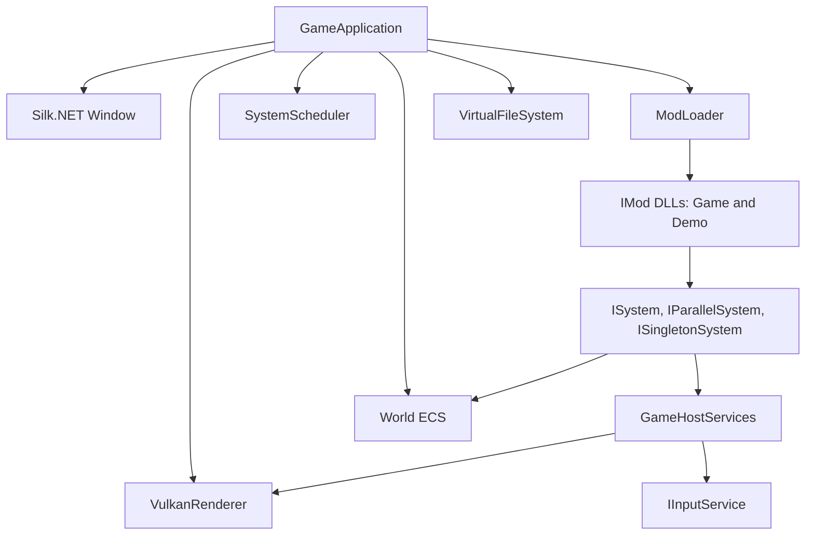

# Cyberland

Cyberland is a **cyberpunk 2D single-player RPG** built in C# on **.NET 8**. The codebase separates a reusable **engine**, a thin **host** executable, and **gameplay delivered as mods** (including the shipped base game). Rendering uses **Vulkan** (via Silk.NET); audio uses **OpenAL**.

Design goals: **small footprint**, **predictable load**, and **scaling from integrated GPUs to modern hardware**—see `.cursor/rules/cyberland-design-goals.mdc` for detail.

---

## Requirements

| Requirement | Notes |
|-------------|--------|
| **.NET 8 SDK** | Required to build and run. |
| **Vulkan 1.x + a working driver** | The host runs a **2D HDR** pipeline (deferred lighting, bloom, composite to the swapchain). Init failures surface via **`UserMessageDialog`** / **`GraphicsInitializationException`** instead of crashing silently. Runtime issues use **`EngineDiagnostics`** (see [Engine subsystems](#engine-subsystems-cyberlandengine)). |
| **Windows** | Primary target; input and error UI are written with that in mind (other platforms may work where Silk.NET + Vulkan do). |

---

## Quick start

From the repository root:

```powershell
dotnet build Cyberland.sln -c Debug
dotnet run --project src/Cyberland.Host/Cyberland.Host.csproj -c Debug
```

Or run via script:

```powershell
.\scripts\Run-Cyberland.ps1
.\scripts\Run-Cyberland.ps1 -Watch   # dotnet watch run
```

If PowerShell reports that the script **is not digitally signed** (often in an **elevated** shell with a strict policy), use the matching **`.cmd`** wrapper instead—it runs the same script with `-ExecutionPolicy Bypass`: `.\scripts\Run-Cyberland.cmd`, `.\scripts\Publish-Cyberland.cmd`, `.\scripts\Sync-CyberlandAssets.cmd`, `.\scripts\Clear-CyberlandArtifacts.cmd`, `.\scripts\Setup-GitHooks.cmd`. Alternatively: `Set-ExecutionPolicy -ExecutionPolicy RemoteSigned -Scope CurrentUser` (applies only to your user), or a one-off `powershell -NoProfile -ExecutionPolicy Bypass -File .\scripts\Run-Cyberland.ps1`.

**Visual Studio Code / Cursor:** default build task builds the solution; **Run** / **Watch** tasks run the host; launch configuration **Cyberland.Host** debugs under **`artifacts/bin/Cyberland.Host/debug/`** so `Mods/` resolves next to the executable.

**Finding Run / Publish:** Names like **Cyberland: Run** are **workspace tasks**, not standalone Command Palette commands—you will not see them when you only open the palette and search for “Cyberland” or “Publish”. Open the repo **folder** (the directory that contains `Cyberland.sln` and `.vscode/tasks.json`), then use **Command Palette** → **Tasks: Run Task** (or **Terminal → Run Task…**), and pick the task from the list. You can type `task` in the palette to jump to **Tasks: Run Task** quickly.

Open the **Command Palette** (`Ctrl+Shift+P`) → **Tasks: Run Task** → pick a **Cyberland:** task (same commands as the Cursor skills):

| Task | Action |
|------|--------|
| **Cyberland: Run** | `dotnet run` the host (Debug) — *run-cyberland* skill |
| **Cyberland: Test Engine** | Engine tests with coverlet — *test-cyberland-engine* skill |
| **Cyberland: Publish Release** | `dotnet publish` (MSBuild stages `Mods/` into **`artifacts/publish/...`**) — full distributable folder — *publish-cyberland* skill (see `scripts/Publish-Cyberland.ps1`) |
| **Cyberland: Publish Release + distribution zip** | Same as Publish Release, then writes **`artifacts/dist/Cyberland-Host-release.zip`** (archive the publish tree for upload) |
| **Cyberland: Zip publish output only** | `Archive-CyberlandPublish.ps1` — zip an existing publish folder without rebuilding |
| **Cyberland: Clear Artifacts** | Delete repo-root `artifacts/` — *clear-cyberland-artifacts* skill (see `scripts/Clear-CyberlandArtifacts.ps1`) |

---

## Asset setup (GitHub Releases)

Large game media does not live in git. Asset bundles are published in GitHub Releases and mapped by per-mod manifests:

- `mods/Cyberland.Game/content.release.manifest.json`
- `mods/Cyberland.Demo/content.release.manifest.json`

Each bundle is tied to one mod and extracts into that mod's `Content/` folder:

- `mods/Cyberland.Game/Content/`
- `mods/Cyberland.Demo/Content/`

From repository root:

```powershell
.\scripts\Sync-CyberlandAssets.ps1
```

The script discovers each mod manifest, downloads release archives, verifies SHA256, and extracts to the mod-owned content folders above.

### Git hook setup (recommended)

This repo includes a pre-commit hook that blocks staged files larger than 4 MiB by default, and rejects commits when any **shipped demo mod** manifest (`mods/Cyberland.Demo*/manifest.json`) is not **`"disabled": true`** in the staging area (so local testing can enable demos without that state landing in git).

```powershell
.\scripts\Setup-GitHooks.ps1
```

Override options for exceptional cases:

- One-off bypass: `git commit --no-verify`
- Maintainer local override: `CYBERLAND_ALLOW_LARGE_FILES=1 git commit ...`
- Temporary threshold override: `CYBERLAND_MAX_FILE_MB=8 git commit ...`
- Demo manifest override (use sparingly): `CYBERLAND_ALLOW_DEMO_MODS_ENABLED=1 git commit ...`

If you bypass, follow up by moving large media into the GitHub Releases asset flow.

### Build output (`artifacts/`)

The solution uses **.NET 8 [artifacts output layout](https://learn.microsoft.com/en-us/dotnet/core/sdk/artifacts-output)** (`UseArtifactsOutput` + `ArtifactsPath` in **`Directory.Build.props`**). **All** compiled output, intermediates, and **`dotnet publish`** output go under **`artifacts/`** at the repo root—**not** into `bin/` / `obj/` next to each `.csproj`.

| Path | Contents |
|------|----------|
| **`artifacts/bin/<ProjectName>/debug/`** or **`.../release/`** | Built assemblies and deps (e.g. **`artifacts/bin/Cyberland.Host/debug/Cyberland.Host.exe`**). Mod staging runs on **build** and places **`Mods/`** here next to the host. |
| **`artifacts/obj/...`** | MSBuild intermediate files per project. |
| **`artifacts/publish/<ProjectName>/debug/`** or **`.../release/`** | **`dotnet publish`** output for that project (e.g. **`Cyberland.Host.exe`** and dependencies). **`Mods/`** is staged here by the same **`scripts/StageModsForHost.ps1`** step that runs after publish. |

After **Cyberland.Host** builds, mods are **staged** next to the host executable under `Mods/`:

| Folder | Contents |
|--------|----------|
| **`Mods/Cyberland.Game/`** | Base campaign mod: `Cyberland.Game.dll`, `manifest.json`, `Content/` (synced from release bundles). **Enabled** by default (`manifest.json` has no **`disabled`** flag). |
| **`Mods/Cyberland.Demo/`** | 2D HDR deferred sprite + ECS sample. **`disabled`: `true`** in `manifest.json` by default — see [Enabling a demo mod for testing](#enabling-a-demo-mod-for-testing). |
| **`Mods/Cyberland.Demo.Pong/`**, **`...Snake/`**, **`...BrickBreaker/`** | Arcade samples; **`disabled`: `true`** by default. |

**`scripts/StageModsForHost.ps1`** runs after **build** and after **publish**: it **removes the host’s existing `Mods/` folder**, then for each enabled mod under **`mods/`** copies **`manifest.json`** and **`Content/`** (when present). Mods with an **`entryAssembly`** in **`manifest.json`** also run **`dotnet build`** on that mod’s **`.csproj`** and copy built **`.dll`** files (except **`Cyberland.Engine.dll`**). Mods that **omit** **`entryAssembly`** are **content-only** (e.g. locale or asset packs): no project build, no DLL—same behavior as **`ModLoader`** at runtime. Skips manifests with **`"disabled": true`**. That wipe prevents a mod you disabled in source from leaving an old copy next to the exe (which would still load).

### Clean build and packaging

Use this when you want a **fresh tree** or a **folder you can zip** and run elsewhere (framework-dependent builds still need the **.NET 8** runtime on the target machine unless you publish self-contained).

1. **Optional — wipe build outputs** (close any running **`Cyberland.Host.exe`** first):

   ```powershell
   if (Test-Path artifacts) { Remove-Item -Recurse -Force artifacts }
   ```

2. **Publish Release** from the repository root:

   ```powershell
   dotnet publish src/Cyberland.Host/Cyberland.Host.csproj -c Release
   ```

   Output: **`artifacts/publish/Cyberland.Host/release/`** (executable + dependencies).

3. **Sync mod media assets** (if not already synced):

   ```powershell
   .\scripts\Sync-CyberlandAssets.ps1
   ```

4. **Package** — archive **`artifacts/publish/Cyberland.Host/release/`** (e.g. zip that folder). **`Mods/`** is already next to the published exe. **`input-bindings.json`** is created at runtime next to the exe if missing.

**RID-specific publish** (platform-native dependencies, still uses the shared .NET 8 runtime — small download), example for Windows x64:

```powershell
dotnet publish src/Cyberland.Host/Cyberland.Host.csproj -c Release -r win-x64 --self-contained false
```

Or use **`.\scripts\Publish-Cyberland.ps1 -RuntimeIdentifier win-x64`** (same idea). Add **`-SelfContained`** to the script, or **`--self-contained true`** here, only when you need a larger offline bundle that does not rely on an installed runtime.

Project-specific notes for agents live in **`.cursor/skills/publish-cyberland/`** and **`.cursor/skills/clear-cyberland-artifacts/`**.

---

## Testing (engine)

The **`Cyberland.Engine.Tests`** project targets **`Cyberland.Engine`** only (not the host, mods, or GPU paths). It enforces **100% line coverage** on that assembly via **coverlet**.

GitHub Actions runs this automatically in the **`Engine Tests`** workflow for pull requests and pushes to **`master`** when paths under `src/Cyberland.Engine/`, `tests/`, or related config change (plus manual `workflow_dispatch`).

```powershell
dotnet test tests/Cyberland.Engine.Tests/Cyberland.Engine.Tests.csproj -c Debug /p:CollectCoverage=true
```

Use the command above for local feedback before pushing. CI remains the merge gate for engine coverage.

Coverage outputs **`coverage.cobertura.xml`** next to the test project output (ignored by git).

Types that require a real **window**, **Vulkan**, **OpenAL**, or **Win32 MessageBox** are marked **`[ExcludeFromCodeCoverage]`** (`VulkanRenderer`, `GameApplication`, `OpenALAudioDevice`, parts of `GlslSpirvCompiler`, `UserMessageDialog.ShowError`). When you change those, add or extend **manual / integration** checks; keep pure logic testable in isolation.

---

## Repository layout

```
Cyberland.sln
Directory.Build.props          # Shared SDK, language settings, artifacts output root
artifacts/                     # Build outputs (gitignored): bin/, obj/, publish/
tests/
  Cyberland.Engine.Tests/      # xUnit + coverlet (100% line coverage on Cyberland.Engine)
  Cyberland.TestMod/           # Minimal IMod assembly used by ModLoader tests
src/
  Cyberland.Host/              # Executable: references Engine only; mods staged by scripts/StageModsForHost.ps1
  Cyberland.Engine/            # Engine library (ECS, Vulkan, input, mods, assets, …)
mods/
  Cyberland.Game/              # Base campaign mod (IMod, locale Content/)
  Cyberland.Demo/              # Sample mod (manifest disabled by default; see README)
  Cyberland.Demo.Pong/ …       # Arcade demos (same)
scripts/
  Run-Cyberland.ps1
  Publish-Cyberland.ps1
  Archive-CyberlandPublish.ps1
  StageModsForHost.ps1
  Clear-CyberlandArtifacts.ps1
.vscode/
  tasks.json, launch.json
.cursor/rules/                 # Optional agent / team conventions
```

| Project | Role |
|---------|------|
| **Cyberland.Host** | Entry point (`Program.cs` → `GameApplication`). References **`Cyberland.Engine`** only at compile time. **`scripts/StageModsForHost.ps1`** (MSBuild after **Build** / **Publish**) builds each **`mods/*/`** project and stages enabled mods into **`Mods/`** next to the host output. |
| **Cyberland.Engine** | All shared runtime: windowing, Vulkan renderer, ECS, task scheduler, virtual FS, assets, localization, OpenAL, mod loader, `GameHostServices`. |
| **Cyberland.Game** | Base campaign mod → `Cyberland.Game.dll` (locale and future core data). Loaded by default. |
| **Cyberland.Demo** (and **Pong** / **Snake** / **BrickBreaker**) | Sample mods → respective DLLs. **`disabled`: `true`** in each **`manifest.json`** by default so normal runs load only the base game. |

---

## High-level architecture



1. **Host** creates the window, graphics, input service, input bindings, ECS world, scheduler, and VFS, then calls **`ModLoader.LoadAll`** on `AppContext.BaseDirectory/Mods`.
2. For each mod with an entry assembly, **`ModLoader`** runs **`IMod.OnLoadAsync`** (to completion on the load thread) with a **`ModLoadContext`**: world, scheduler, localization, VFS, and **`Host`** (`GameHostServices`).
3. Mods **register systems** on the scheduler and optionally spawn entities, mount extra paths, etc.
4. Each presented frame, the window **Render** callback runs **`SystemScheduler.RunFrame(world, dt)`** once (with **`deltaSeconds`** from wall time between draws), then **`VulkanRenderer.DrawFrame`**. **`RunFrame`** walks the **same ordered list** of registrations for three **phases**—**Early** (variable dt), **Fixed** (zero or more substeps at **`FixedDeltaSeconds`**, capped by **`MaxSubstepsPerFrame`**), **Late** (variable dt)—invoking **`IEarlyUpdate`/`IFixedUpdate`/`ILateUpdate`**, **`IParallelEarlyUpdate`/`IParallelFixedUpdate`/`IParallelLateUpdate`**, or **`ISingletonEarlyUpdate`/`ISingletonFixedUpdate`/`ISingletonLateUpdate`** (for **`ISingletonSystem`**) where implemented. The **`Update`** callback is intentionally empty so ECS does not run multiple times per draw. Input and exit behavior are handled inside **mod** systems (the host wires **`Renderer.RequestClose`** to close the window; shipped demos invoke it from input when exiting).

**Rule of thumb:** *If it is gameplay, it belongs in a mod (or a new mod assembly), not in `GameApplication`.*

**Default engine systems (2D):** The host registers systems in a fixed **explicit order**: parallel **transform hierarchy**, **sprite animation**, and **CPU particle simulation**; then **`ModLoader.LoadAll`** (mods append **`RegisterSerial`** / **`RegisterParallel`** in manifest order); then parallel **`CameraFollowSystem`** (**`cyberland.engine/camera-follow`**) for optional **`CameraFollow2D`**, parallel **`TriggerSystem`** (**`cyberland.engine/trigger`**) so trigger events reflect mod-updated fixed-step poses from the same substep, parallel **`CameraSubmitSystem`** (**`cyberland.engine/camera-submit`**) for **`Camera2D`** + **`Transform`**; then serial **`ViewportAnchorSystem`** (**`cyberland.engine/viewport-layout`**) for **`ViewportAnchor2D`** + **`Transform`**; parallel light submitters (**`cyberland.engine/lighting-ambient`**, **`…/lighting-directional`**, **`…/lighting-spot`**, **`…/lighting-point`**) over **`AmbientLightSource`**, **`DirectionalLightSource` + `Transform`**, **`SpotLightSource` + `Transform`**, and **`PointLightSource` + `Transform`**; parallel **`PostProcessVolumeSystem`** (**`cyberland.engine/post-process-volumes`**) for **`PostProcessVolumeSource`**; then parallel **tilemap** submit, serial **`SpriteLocalizedAssetSystem`** (**`cyberland.engine/sprite-localized-assets`**) for **`SpriteLocalizedAsset`** texture resolution, parallel **sprite** and **particle** submit systems; then serial **`TextStagingSystem`** (**`cyberland.engine/text-staging`**) and **`TextRenderSystem`** (**`cyberland.engine/text-render`**) for **`BitmapText`** + **`Transform`** (see **`TextCoordinateSpace`**). Prefer these ECS-driven paths over calling **`Submit*Light`** / **`SubmitPostProcessVolume`** / **`SubmitCamera`** from mod code unless you need a special-case. After **`VulkanRenderer`** initialization, **`GameApplication`** applies baseline HDR globals once via **`EngineDefaultGlobalPostProcess.Apply`** (not every frame). Mods replace or extend those settings by calling **`SetGlobalPostProcess`** from **`IMod.OnLoadAsync`** (later loads win over earlier ones) or from a system when values must track the frame. **`BitmapText`** in **`TextCoordinateSpace.ScreenPixels`** often pairs with **`ViewportAnchor2D`** so HUD labels track **`ActiveCameraViewportSize`** (the camera's virtual canvas, not the letterboxed physical window).

---

## Engine subsystems (Cyberland.Engine)

### ECS (`Core/Ecs`)

- **`World`** — entity creation/destruction; owns an **archetype graph** (entities with the same component *signature* share fixed-size **chunks** with SoA columns for cache-friendly iteration).
- **`Components<T>()`** / **`ComponentStore<T>`** — **`GetOrAdd`**, **`TryGet`**, **`Get`**, **`Remove`**, **`Contains`** for entity-scoped access.
- **`QueryChunks<T>()`** / **`QueryChunks<T0, T1>()`** — foreach over **chunks**; each yields contiguous **`Span<T>`** columns (and matching **`EntityId`** rows) for SIMD-friendly inner loops. Helpers such as **`SimdFloat`** operate on those spans.
- **`ChunkQueryAllExtensions`** / **`WorldQueryExtensions`** — **`RequireSingleEntity(label)`** (any archetype, exactly one row), **`RequireSingleEntityWith<TComponent>(label)`**, and **`TryGetSingleEntityWith<TComponent>(out EntityId)`** for singleton-style queries.
- **`EntityId`** — opaque id from **`EntityRegistry`**.

Components are **`struct`** types; define them in your mod assembly (see `Velocity` in **`Cyberland.Demo`**).

### Task scheduler (`Core/Tasks`)

- **`SystemScheduler`** — one ordered list of **`RegisterSerial`** / **`RegisterParallel`** / **`RegisterSingleton`** calls. **`RunFrame`** walks entries in **registration order** within each phase: **Early** (real **`deltaSeconds`**), **Fixed** (constant **`FixedDeltaSeconds`**, accumulator + substeps), **Late** (real **`deltaSeconds`** again). Serial and parallel entries run **`ISystem.OnStart`** / **`IParallelSystem.OnStart`** at most **once** per registration (first frame the entry is enabled), with **`World`** and a matching **chunk** query passed **only in `OnStart`**. **`ISingletonSystem`** entries resolve **exactly one** entity from **`QuerySpec`** at startup (non-empty spec), then call **`OnSingletonStart(in SingletonEntity)`** once and **`ISingletonEarlyUpdate`** / **`ISingletonFixedUpdate`** / **`ISingletonLateUpdate`** with a **`SingletonEntity`** handle (**`Get<T>()`** / **`TryGet<T>`** on that row) instead of **`ChunkQueryAll`**. Chunk-based systems take the **per-phase chunk iterator** and timing, not **`World`** in the phase signature—cache **`World` in `OnStart`** when needed. Optional **`AfterEarlyUpdate`**, **`AfterFixedUpdate`**, **`AfterLateUpdate`** fire once per frame after each phase. Disabled entries are skipped entirely until **`SetEnabled(logicalId, true)`**; re-enabling does **not** run **`OnStart`** / **`OnSingletonStart`** again. Replacing a logical id resets lifecycle so the new instance gets start once. **`SetEnabled`**, **`SystemStarted`**, **`SystemEnabled`**, **`SystemDisabled`**, and **`SystemUnregistered`** (from **`TryUnregister`**) are the hooks for introspection and debugging.
- **`ParallelismSettings.MaxConcurrency`** — `0` means use all logical processors.

Within each phase, order is still **global registration order**: each entry is **`ISystem`** (serial), **`IParallelSystem`** (parallel), or **`ISingletonSystem`** (serial, single-row), in the order registered. The host registers engine systems first, mods append during **`LoadAll`**, then the host appends render submit systems—so a mod’s systems run **between** pre-mod and post-mod blocks according to **`OnLoadAsync`** registration order, while **Early** vs **Fixed** vs **Late** is determined by which interfaces each system implements.

### Rendering (`Rendering/`)

- **`IRenderer`** (implemented by **`VulkanRenderer`**) — mod-facing API: **`SubmitSprite`**, **`SubmitTextGlyph`** / **`SubmitTextGlyphs`** (dedicated text path), **`SubmitPointLight`**, **`SubmitSpotLight`**, **`SubmitDirectionalLight`**, **`SubmitAmbientLight`**, **`SubmitPostProcessVolume`**, **`SetGlobalPostProcess`**, **`SubmitCamera`**, **`RegisterTextureRgba`**, **`RegisterTextureRgbaLinear`** (MSDF atlas pages, linear UNORM sampling), **`TryUploadTextureRgbaSubregion`**, **`RequestClose`**, plus **`SwapchainPixelSize`** (physical window) and **`ActiveCameraViewportSize`** (camera virtual canvas, used for HUD layout). **CPU-side** submit queues are **thread-safe** for **`IParallelSystem`** workers; GPU command recording and **`DrawFrame`** stay on the render thread.
- **Camera (`Camera2D`)** — mods place a camera entity with **`Transform`** + **`Camera2D`** to define the player's view into the world. The camera's **`ViewportSizeWorld`** is a fixed virtual canvas in world pixels; non-matching window sizes **letterbox / pillarbox** instead of showing more or less world. The highest-**`Priority`** enabled camera renders each frame; ties break by submit order. With no camera entity the renderer falls back to a default centered on the swapchain. **Post-process volumes** now apply when the active camera's **world position** is inside the volume's oriented box (not based on what's visible), so pools of effect are tied to where the camera stands.
- **HDR frame pipeline (scene-linear offscreen targets, tonemap in composite):** emissive prepass (optional per-texel **`EmissiveTextureId`**) → **G-buffer** (opaque sprites only) → **HDR**: fullscreen base lighting (ambient / directional / spot) + **all** submitted **point lights** (instanced draw, SSBO) + emissive bleed → **weighted blended OIT** for **transparent** sprites → resolve to HDR → **bloom** → **composite** to the swapchain. Sort order for sprites is **layer → sort key → depth hint**; **straight alpha** where applicable. See **`.cursor/rules/cyberland-design-goals.mdc`** for linear-color and modularity goals.
- **Opaque vs transparent:** set **`SpriteDrawRequest.Transparent`** / **`Sprite.Transparent`** for glass-style draws (WBOIT over opaque HDR); otherwise the sprite goes through the deferred G-buffer path.
- **Sprite instancing (profiling):** world and swapchain-overlay sprites are encoded as **instanced batch runs** (shared contiguous keys for albedo / normal or emissive / clip). Cast **`IRenderer`** to **`VulkanRenderer`** in host or debug builds to read **`LastFrameOverlaySpriteDrawCalls`**, **`LastFrameDeferredOpaqueSpriteDrawCalls`**, **`LastFrameDeferredEmissiveSpriteDrawCalls`**, **`LastFrameDeferredTransparentSpriteDrawCalls`**, and matching **`*Instances`** / **`*BatchCount`** counters after a presented frame.

- **CPU frame profiler (hierarchical scopes, Debug only):** pass **`--profile-dump=path`** with a **Debug** engine build to write per-scope CPU aggregates on exit (after warmup). **`--profile-dump`** is ignored in **Release** (stderr explains); scope capture, **`FrameProfilerStats`**, and **`FrameProfilerScope`** are not compiled into Release. **`--profile-seconds=N`** still forces uncapped pacing and a timed run in **Release** for lightweight checks; pair it with **`--perf-dump=path`** for FPS and startup or glyph counters (no hierarchical scopes). In **Debug** builds, **F10** (`cyberland.engine/profile-hud`) can mirror top scopes to the window title; mods can append the same text via **`FrameProfilerOverlay.AppendHud`** (no-op overlay text in Release). For a demo mod without leaving **`disabled: true`** in git, use **`.\scripts\Profile-CyberlandDemo.ps1 -Demo idlegold`** (same manifest toggle pattern as **`Run-CyberlandDemo-Test.ps1`**). The script now also writes `--perf-dump` with startup milestones (`startupLoadCallbackMs`, `startupFirstPresentMs`) plus glyph cache counters (`glyphCacheMisses`, `glyphBakedImports`). For a one-command guardrail run, use **`.\scripts\Run-IdleGoldPerfSmoke.ps1`** (profiles, checks frame scopes, FPS, startup thresholds, and baked atlas effectiveness). To compare incremental HUD layout vs full measure every frame, set **`CYBERLAND_USE_INCREMENTAL_UI=0`** (or **`false`**); **`1`** / **`true`** re-enables **`UiLayoutGating.UseIncrementalDocumentFrames`** (see **`UiLayoutGating.ApplyEnvironmentDefaults`** on startup).
- **Coordinate spaces** — three layered frames with explicit helpers:
  - **World** (+Y up, gameplay math): sprites with **`SpriteCoordinateSpace.World`** (default), all `*World` light / volume positions, `Camera2D` world position.
  - **Camera virtual viewport** (+Y down, extent **`IRenderer.ActiveCameraViewportSize`**): HUD / UI math. **`SpriteCoordinateSpace.Viewport`** sprites, **`BitmapText`** with **`CoordinateSpace.ScreenSpace`**, and **`ViewportAnchor2D`** all layout against this canvas so the HUD stays locked across window resizes (letterbox / pillarbox bars don't clip UI).
  - **Swapchain** (physical window, **`IRenderer.SwapchainPixelSize`**): the renderer uniformly scales the virtual viewport into this surface.
  - **`CameraProjection`** converts world ↔ viewport ↔ swapchain; **`WorldScreenSpace`** is a Y-flip helper within a single canvas (still useful for gameplay math that mixes +Y up and +Y down). Keep gameplay in world space rather than duplicating conversions.
- **Text (`Rendering/Text/`)** — CPU glyph rasterization (SixLabors) into packed **atlas pages** (2048²) now produces **MSDF-style glyph tiles** and submits them through the dedicated text queue as **`TextGlyphDrawRequest`** entries (not per-glyph sprite draws). The first use of a page calls **`IRenderer.RegisterTextureRgbaLinear`** for the full page so the GPU samples distance data as **linear UNORM** (no sRGB curve); additional glyphs on that page use **`TryUploadTextureRgbaSubregion`**. **`VulkanRenderer`** records text in the swapchain UI overlay pass with **instanced draws**, batching by atlas texture and clip state to keep glyph draw-call counts low on large HUD screens. **`FontLibrary`** maps logical family ids to one or more TTF/OTF byte sources; **`RegisterFamilyFromBytes`** is the mod path after **`MountDefaultContent()`** and loading bytes from **`AssetManager`** (e.g. `Content/Fonts/...`). **`BuiltinFonts.AddTo(library)`** registers embedded faces under stable ids **`cyberland.engine/ui`** (sans) and **`cyberland.engine/mono`** (monospace) so samples work without shipping fonts. **`TextGlyphCache`** memoizes rasterized glyphs; GPU memory grows **lazily** as characters are drawn (no engine-wide preload of full font glyph sets). Atlas textures stay **resident** for the session unless a future explicit release API or hard resource limits apply—**`TextGlyphCache.Clear`** clears CPU maps only.
- **Baked MSDF atlases (engine + mods):** engine defaults ship pre-baked manifests/pages in **`src/Cyberland.Engine/Rendering/Text/Baked/`** and load at startup before runtime rasterization fallback. Regenerate engine baked assets with **`.\scripts\Generate-BakedMsdfAtlases.ps1`**. For mod custom fonts, mount content + register the font family, then call **`context.LoadBakedMsdfAtlas("Fonts/<family>/atlas/<name>.manifest.json")`**; any missing glyphs still fall back to runtime MSDF generation.

### Input (`Input/`)

- **`IInputService`** / **`SilkInputService`** — frame-stable input abstraction over Silk devices. The host calls **`BeginFrame()`** once per render tick before ECS updates; systems then read stable action, axis, and mouse state for that frame. **`FrameGameplayCommands`** lists logical press/release edges for that tick (stable across early/fixed/late); **`InputGameplayCommandExtensions`** (`HasActionPressedThisFrame`, etc.) scan them. **`ConsumePressed`** / **`ConsumeReleased`** / **`ConsumeAxisDelta`** still buffer across frames when fixed update may skip ticks.
- **`InputBindings`** — runtime-editable map from action/axis ids to one or more **`InputBinding`** entries, loaded from `input-bindings.json` under the app base directory.
- **`InputControl`** — persisted physical control token (`keyboard:*`, `mouse:*`, `mouseAxis:*`) used by binding JSON and runtime rebind APIs.

### Assets (`Assets/`)

- **`VirtualFileSystem`** — ordered mount points; **later mounts override earlier** (mod content over base). **`BlockPath`** hides a relative path globally (even if an earlier mount had the file).
- **`AssetManager`** — async **`LoadBytesAsync`**, **`LoadTextAsync`**, **`LoadJsonAsync`**, streaming **`OpenReadOrThrow`**.

### Localization (`Localization/`)

- **`ILocalizedContent`** / **`LocalizedContent`** — single façade for **strings** and **localized media paths**. Call **`MergeStringTableAsync("snake.json")`** (table file name only; IO uses the same layered VFS as **`ModLoadContext.VirtualFileSystem`**) so the engine loads **`Content/Locale/en/…`**, then parent cultures, then the active language (later merges override keys). Use **`TryResolveLocalizedPath`**, **`TryLoadLocalizedBytesAsync`**, **`TryLoadLocalizedTexture`** (synchronous, on the render thread for **`IRenderer`** registration), **`TryLoadLocalizedTextureAsync`**, or **`TryOpenLocalizedRead`** for player-facing textures/audio/video instead of hardcoding **`Locale/en/…`**.
- **`LocalizationManager`** — merged key → string table behind **`ILocalizedContent.Strings`**; **`TryRemoveKey`** / **`RemoveKey`** drop keys for later mods.
- **Active language** — read from **`language.json`** next to the executable (`{ "primaryCulture": "de" }`). Override per launch with **`--lang=de`** or **`--lang de`** (takes precedence). Changing language requires a **restart**; the host merges **`strings.json`** after all mods load.
- **Language-pack mods** — ship **`Content/Locale/{culture}/…`** with a **higher `loadOrder`** than the content you override. Omit **`entryAssembly`** in **`manifest.json`** for a **content-only** pack (no DLL); staging copies **`manifest.json`** + **`Content/`** only.
- **`TextRenderer.DrawLocalized`** resolves keys at draw time; pair with merged JSON tables for HUD copy.

### Audio (`Audio/`)

- **`OpenALAudioDevice`** — optional; host continues without audio if OpenAL is missing.

### Modding (`Modding/`)

- **`IMod`** — **`OnLoadAsync(ModLoadContext)`**, **`OnUnload()`**.
- **`ModManifest`** — id, version, **`entryAssembly`**, **`contentRoot`**, **`loadOrder`**, optional **`disabled`**, optional **`contentBlocklist`** (see `manifest.json`).
- **`ModLoader`** — discovers `Mods/*/manifest.json`, skips mods with **`disabled`**: **`true`** or ids listed in the optional **CLI exclude set**, mounts remaining content (then applies each mod’s blocklist), loads **`entryAssembly`** in the default assembly load context with a **`Resolving`** hook so satellite **`.dll`** files resolve from the mod folder (and optional **`lib/`**), finds one concrete **`IMod`**, awaits **`OnLoadAsync`** to completion.

### Hosting (`Hosting/`)

- **`GameHostServices`** — **`Renderer`** (**`IRenderer?`**; concrete type **`VulkanRenderer`**), **`Input`** (**`IInputService?`**), **`LocalizedContent`** (**`ILocalizedContent?`**), built-in **`Fonts`** (**`FontLibrary`**) and **`TextGlyphCache`** for **`TextRenderSystem`** / **`TextRenderer`**, optional **`Tilemaps`** (**`ITilemapDataStore?`**) and **`Particles`** (**`ParticleStore?`**) for tile indices and CPU particle buffers used by engine render/sim systems. **`LastPresentDeltaSeconds`** is wall time between draws (matches ECS **`deltaSeconds`** in the stock host, which runs **`RunFrame`** once per **Render** tick). Populated by **`GameApplication`** after the window and device exist, then passed into **`ModLoadContext`** so mods do not use static globals.

### Diagnostics (`Diagnostics/`)

- **`EngineDiagnostics`** — structured reporting with **`EngineErrorSeverity`**: **Fatal** (use **`ReportFatal`**, dialog then process exit), **Major** / **Minor** / **Warning** (use **`Report`**). Until **`GameApplication`** enables native notifications after successful Vulkan init, delivery defaults to **stderr**; afterward **Major** uses an error-style dialog, **Minor** uses a warning-style dialog with **session deduplication** per identical title+message, **Warning** stays on stderr (plus debug output in the native configuration). Calls are **serialized** so parallel ECS workers do not interleave Win32 dialogs.
- **`EngineUnhandledExceptionBootstrap.Install()`** — invoked from **`Program.cs`** before **`GameApplication`** runs: **unhandled** exceptions show a dialog and exit; **unobserved** task exceptions are logged as **Warning** and marked observed.
- **`UnhandledExceptionFormatter`** — builds readable text for crash dialogs from arbitrary exception payloads.

### Scene (`Scene/`)

- **Components** — **`Transform`** (local/world 2D homogeneous matrices + optional parent, with lazily decomposed position/rotation/scale properties), **`Sprite`** (includes **`Transparent`** for WBOIT vs deferred opaque path; optional **`EmissiveTextureId`**), **`SpriteLocalizedAsset`** (localized texture path binding for sprites), **`BitmapText`** (HUD strings; pair with **`Transform`** for baseline), **`Tilemap`**, **`SpriteAnimation`**, **`ParticleEmitter`**, **`CameraFollow2D`** (fixed-step camera target follow).
- **Stores** — **`TilemapDataStore`** / **`ITilemapDataStore`**, **`ParticleStore`** (indexed by entity; not stored inside ECS chunks).
- **Systems** (registered by the host; see frame order above) — **`TransformHierarchySystem`**, **`SpriteAnimationSystem`**, **`ParticleSimulationSystem`**, **`TilemapRenderSystem`**, **`SpriteRenderSystem`**, **`ParticleRenderSystem`**, **`TextRenderSystem`**. Baseline global post lives in **`EngineDefaultGlobalPostProcess`** (applied at init, not as a system).

Mods typically attach **`Sprite`** + **`Transform`** and let **`SpriteRenderSystem`** submit draws; for bitmap UI copy, add **`BitmapText`** + **`Transform`** and let **`TextRenderSystem`** call **`TextRenderer`** using host **`Fonts`** / **`TextGlyphCache`**, instead of custom HUD render systems.

---

## Mod system (convention)

### Folder layout on disk

```
Mods/
  Cyberland.Game/         # loadOrder 0 — locale, future core assets
  Cyberland.Demo/         # loadOrder 10 — 2D sample (disabled by default in manifest)
  Cyberland.Demo.Pong/    # arcade demos (disabled by default)
  Cyberland.Demo.Snake/
  Cyberland.Demo.BrickBreaker/
    manifest.json
    *.dll
    Content/                # mounted to VFS (last mod wins for same path)
```

### Enabling a demo mod for testing

Shipped **demo** mods (**`Cyberland.Demo`**, **Pong**, **Snake**, **BrickBreaker**) have **`"disabled": true`** in their **`mods/<...>/manifest.json`** so a normal **`dotnet run`** loads only **`cyberland.base`**.

1. **Turn on one demo** — In the repo, open that mod’s **`manifest.json`** and set **`"disabled": false`** (or remove the **`disabled`** property). Rebuild so staging refreshes **`artifacts/.../Mods/`** from source (each build **replaces** that folder, so disabling a demo you had enabled removes it from the output). Alternatively, edit **`manifest.json`** next to the host exe under **`Mods/<ModName>/`** if you are iterating **without** rebuilding (the next build overwrites from **`mods/`** in the repo).
2. **Skip the base game** — The base mod’s id is **`cyberland.base`**. Pass **`--exclude-mods`** so only your demo runs:

   ```powershell
   dotnet run --project src/Cyberland.Host/Cyberland.Host.csproj -c Debug -- --exclude-mods cyberland.base
   ```

   Add other ids to the comma-separated list if you temporarily enable multiple mods and want to exclude some of them.

3. **Sync assets** — Demo **`Content/`** may still need **`.\scripts\Sync-CyberlandAssets.ps1`** (see [Asset setup](#asset-setup-github-releases)).

### `manifest.json`

Example (see `mods/Cyberland.Game/manifest.json`):

- **`id`** — stable string id.
- **`entryAssembly`** — DLL name containing an **`IMod`** implementation.
- **`contentRoot`** — relative folder mounted for this mod (often `Content`).
- **`loadOrder`** — lower runs earlier (manifests sorted by load order, then id).
- **`disabled`** (optional) — when **`true`**, the loader ignores the mod: no content mount, no blocklist, no assembly load (default **`false`**).
- **`contentBlocklist`** (optional) — array of virtual relative paths to hide after this mod’s content is mounted (blocks win over all mounts; use normal file overrides when you want to replace content instead).

### `IMod` implementation

- Ship a **public non-abstract class** implementing **`IMod`** (the loader picks the first exported type assignable to **`IMod`**).
- **`manifest.json`** is the source of truth for id, name, version, **`entryAssembly`**, **`contentRoot`**, **`loadOrder`**, etc.; **`ModLoadContext.Manifest`** in **`OnLoadAsync`** is that deserialized data (do not duplicate it in the **`IMod`** type).
- **`OnLoadAsync`**: register systems (with stable **logical ids**), spawn entities (prefer **`SceneSetup.SetupSceneAsync`** awaited before **`Register*`**), merge localization, call **`context.MountDefaultContent()`** if you rely on `Content/` under the mod folder.

### Systems: ids, extend, replace, remove

Every ECS system is registered with a **non-empty logical id** (convention: `"<modId>/<purpose>"`, e.g. `cyberland.demo/sprite-move`). Mods load in **`loadOrder`** order; a later mod can:

- **Extend** — register **new** ids.
- **Replace** — call **`RegisterSerial`** / **`RegisterParallel`** / **`RegisterSingleton`** again with an id already used; the implementation is swapped **in place** (frame order among other systems stays the same).
- **Remove** — **`TryUnregister(logicalId)`** drops that system from the scheduler list.
- **Toggle without removing** — **`context.SetSystemEnabled(logicalId, …)`** (or **`context.Scheduler.SetEnabled`**) skips per-frame work while keeping registration order and **`OnStart`** semantics (no second **`OnStart`** after re-enable).

Use **`context.RegisterSerial`**, **`context.RegisterParallel`**, **`context.RegisterSingleton`**, **`context.SetSystemEnabled`**, and **`context.TryUnregister`** (wrappers around **`SystemScheduler`**). Do not reuse the same id across **serial** vs **parallel** registration (singleton uses the serial scheduling path; still pick a distinct id if a parallel system occupied it).

### Content and localization overrides

- **Override a file** — ship a file at the same virtual path from a **later** mod (VFS last mount wins).
- **Hide a path** — **`context.HideContentPath("relative/path")`** or declare **`contentBlocklist`** in **`manifest.json`** so the path does not resolve.
- **Remove a localization key** — **`context.TryRemoveLocalizationKey("key")`** after earlier mods merged strings.

### `GameHostServices` (via `context.Host`)

| Member | Use |
|--------|-----|
| **`Input`** | Action/axis queries (`IsDown`, `WasPressed`, `ReadAxis`), **`FrameGameplayCommands`** / extension helpers for same-frame edges, mouse position/delta, runtime rebinds via `Input.Bindings`. |
| **`Renderer`** | **`IRenderer`**: **`SwapchainPixelSize`** / **`ActiveCameraViewportSize`**, **`SubmitSprite`**, **`SubmitPointLight`** / **`SubmitSpotLight`** / **`SubmitDirectionalLight`** / **`SubmitAmbientLight`**, **`SubmitPostProcessVolume`**, **`SetGlobalPostProcess`**, **`SubmitCamera`**, **`RegisterTextureRgba`**, **`RegisterTextureRgbaLinear`**, **`TryUploadTextureRgbaSubregion`**, **`RequestClose`** (e.g. **`Cyberland.Demo`**). |
| **`Tilemaps`** | Optional; holds per-entity tile index buffers for **`TilemapRenderSystem`**. |
| **`Particles`** | Optional; CPU particle buckets for **`ParticleSimulationSystem`** / **`ParticleRenderSystem`**. |

The host sets **`Renderer`** and **`Input`** only after successful window/input setup; systems should null-check when relevant.

---

## Developing new game systems

### 1. Prefer a system in the mod, not the host

Add logic under **`mods/<YourMod>/`** with a **`manifest.json`** and a **`.csproj`** referencing **`Cyberland.Engine`**. Add the mod project to **`Cyberland.sln`**; **`scripts/StageModsForHost.ps1`** picks up each **`mods/*/`** folder that contains **`manifest.json`** (skipped when **`disabled`** is true).

### 2. Define data as components

```csharp
namespace MyMod;

public struct MyComponent
{
    public float Value;
}
```

Use **`world.Components<MyComponent>().GetOrAdd(entity)`** (or **`TryGet`**) to associate state with entities.

### Cold-start scene authoring (convention)

Put **one-off** ECS spawn (camera, session/control tags, playfield, HUD **`BitmapText`** rows, lights, **`GlobalPostProcessSource`**) in a **static** helper beside **`Mod.cs`**—usually **`SceneSetup`** with **`public static async ValueTask SetupSceneAsync(ModLoadContext context, CancellationToken cancellationToken = default)`**. **`Await`** it from **`IMod.OnLoadAsync`** **before** **`RegisterSerial`** / **`RegisterParallel`** / **`RegisterSingleton`**, so startup ordering is deterministic and the scheduler only lists **runtime** systems.

The method stays **`async`** so you can later **`await`** scene JSON, **`ILocalizedContent.MergeStringTableAsync`**, or other I/O without restructuring **`OnLoadAsync`**. Respect **`cancellationToken`** when you add long-running loads.

**Reference:** **`mods/Cyberland.Demo/SceneSetup.cs`**, **`mods/Cyberland.Demo.BrickBreaker/SceneSetup.cs`**, **`mods/Cyberland.Demo.Pong/SceneSetup.cs`**, **`mods/Cyberland.Demo.Snake/SceneSetup.cs`**, **`mods/Cyberland.Demo.MouseChase/SceneSetup.cs`**, and matching **`Mod.cs`** files—same **`SetupSceneAsync`** + **`OnLoadAsync`** pattern.

### 3. Implement `ISystem`, `IParallelSystem`, and/or `ISingletonSystem`

- **`ISystem`** — single-threaded chunk iteration; use for anything that must stay on one thread (some input flows, strict ordering with **`GameHostServices`**).
- **`IParallelSystem`** — use for CPU-heavy work over **`QueryChunks<T>()`** (per-chunk spans are safe to split across **`Parallel.For`** / **`Parallel.ForEach`**); see **`VelocityDampSystem`** in **`Cyberland.Demo`**.
- **`ISingletonSystem`** — exactly **one** entity must match **`QuerySpec`**; phase hooks take **`SingletonEntity`** (**`Get<T>()`** on that row) instead of **`ChunkQueryAll`**. Use for session rows, HUD singletons, or any true single-row driver—see **`IntegrateSystem`** / **`FpsDisplaySystem`** in **`Cyberland.Demo`**.

### 4. Register in your mod’s `IMod.OnLoadAsync` (e.g. `BaseGameMod`, `Cyberland.Demo.Mod`)

```csharp
context.RegisterSerial("my.mod/main", new MySystem(context.Host));
context.RegisterParallel("my.mod/batch", new MyParallelSystem());
context.RegisterSingleton("my.mod/session", new MySingletonSystem());
```

First-time registration order is the run order for the scheduler’s single list. Replacing an existing **logical id** keeps that system’s position in the list.

### 5. Use the ECS world from context

```csharp
var id = context.World.CreateEntity();
ref var c = ref context.World.Components<MyComponent>().GetOrAdd(id);
c = new MyComponent { Value = 1f };
```

### 6. Input and rendering

- Read actions and axes through **`context.Host.Input`** (`IsDown`, `WasPressed`, `ReadAxis`, **`HasActionPressedThisFrame`**, **`ConsumePressed`**, …) and update bindings through **`context.Host.Input.Bindings`** when supporting runtime rebind UI.
- **Lighting** — queue **`SubmitPointLight`**, **`SubmitSpotLight`**, **`SubmitDirectionalLight`**, and **`SubmitAmbientLight`** on **`context.Host.Renderer`** each frame you need them (same **`IRenderer`** as sprites). The deferred path accumulates **all** submitted ambients, **all** directionals and spots in the base fullscreen pass (up to engine caps), and **all** point lights in the instanced pass.
- For drawing, prefer **`Sprite`** + **`Transform`** on entities; the engine’s **`SpriteRenderSystem`** submits **`SpriteDrawRequest`** in **world space** after your mod systems run. For HUD text, prefer **`BitmapText`** + **`Transform`** and **`TextRenderSystem`**. For one-off or procedural draws, build **`SpriteDrawRequest`** yourself and call **`context.Host.Renderer?.SubmitSprite(...)`** (and post volumes as needed).

### 7. Assets and localization

- Resolve paths against the **`VirtualFileSystem`** (mounts include mod **`Content/`** roots in load order).
- Use **`AssetManager`** with the same VFS instance the host constructed (passed through localization/bootstrap as in **`GameApplication`**).

### 8. New mod assembly (optional)

1. Add a project under **`mods/YourMod/`** referencing **`Cyberland.Engine`**.
2. Implement **`IMod`**.
3. Add **`manifest.json`**.
4. Ensure the mod appears under **`mods/YourMod/`** with **`manifest.json`** — no host project reference is required. Rebuild **Cyberland.Host** so **`Mods/YourMod/`** is populated in the output directory.

---

## Reference examples in this repo

| Example | Location | Shows |
|---------|----------|--------|
| Base mod entry | `mods/Cyberland.Game/BaseGameMod.cs` | Minimal **`IMod`**, locale **`Content/`** |
| Demo mod entry | `mods/Cyberland.Demo/Mod.cs` | **`IMod.OnLoadAsync`**, locale **`MergeStringTable`**, **`ModLoadContext.AddDefaultInputBinding`**, **`RegisterSerial` / `RegisterParallel` / `RegisterSingleton`** (e.g. **`cyberland.demo/integrate`**, **`cyberland.demo/velocity-damp`**) |
| BrickBreaker scene | `mods/Cyberland.Demo.BrickBreaker/SceneSetup.cs` | **`SetupSceneAsync`** — cold-start convention (**await** before **`Register*`**); see **`Mod.cs`** |
| Input + sim | `mods/Cyberland.Demo/Systems/InputSystem.cs`, **`IntegrateSystem`**, **`SceneSetup`** | **`IParallelSystem`** (**`InputSystem`**), **`ISingletonSystem`** (**`IntegrateSystem`**), scene tags; HDR cold start in **`SceneSetup`** and **`GameApplication`** baseline |
| Parallel ECS | `mods/Cyberland.Demo/Systems/VelocityDampSystem.cs` | **`IParallelSystem`**, **`QueryChunks<Velocity>`**, **`SimdFloat`** on packed floats |
| Host bootstrap | `src/Cyberland.Engine/GameApplication.cs` | Lifecycle, **`LoadAll`**, optional **`--exclude-mods`** |

Demo mods are **off** in **`manifest.json`** by default; see [Enabling a demo mod for testing](#enabling-a-demo-mod-for-testing). To run **only** the base game with no samples, you do not need **`--exclude-mods`** (demos are already disabled). To load several mods and drop specific ones, use e.g. `--exclude-mods cyberland.demo,cyberland.demo.pong`.

### How shipped samples use the engine

**Game rules and session state** live in mod code (e.g. paddle/ball logic, brick grid, snake movement). **Cyberland.Demo**, **Pong**, **Snake**, **BrickBreaker**, and **MouseChase** drive **`Transform`** / **`Sprite`** from simulation or layout systems and each create a **`Camera2D`** entity during cold start (typically **`SceneSetup.SetupSceneAsync`**, awaited from **`IMod.OnLoadAsync`**) using a fixed 1280×720 virtual canvas so gameplay stays the same size regardless of window resolution. All shipped demo mods follow **`SetupSceneAsync`** before **`Register*`**. The host applies a baseline once via **`EngineDefaultGlobalPostProcess`**, and demo **`SceneSetup`** helpers add a **`GlobalPostProcessSource`** entity where samples tune emissive and bloom. **Cyberland.Demo** updates a fullscreen **`PostProcessVolumeSource`** each late tick (**`cyberland.demo/hdr-post-volume`**) so bloom can track the player. Each demo mod registers its default key bindings in **`OnLoadAsync`** via **`ModLoadContext.AddDefaultInputBinding`**. Use **`ModLayoutViewport.VirtualSizeForSimulation`** / **`VirtualSizeForPresentation`** when you need a consistent virtual canvas read across phases; see in-mod READMEs under **`mods/Cyberland.Demo*`**.

**Cyberland.Demo.Snake** drives **`Sprite`** and **`BitmapText`** entities from a visual sync system (grid-aligned quads); the playfield background uses the engine tilemap path via **`host.Tilemaps`**. Samples use **`GameHostServices.Fonts`** / **`TextGlyphCache`** only when calling **`TextRenderer`** directly for special cases.

---

## Configuration

- **`input-bindings.json`** — lives next to the host executable. First run creates the file with **`InputBindings.LoadDefaults`**, then enabled mods’ **`IMod.OnLoadAsync`** may add more default actions via **`ModLoadContext.AddDefaultInputBinding`**. A user file, when present, replaces the in-memory table at startup before mods run.

---

## Troubleshooting

| Issue | Suggestion |
|-------|------------|
| **Vulkan / GPU errors on startup** | Update GPU drivers; ensure Vulkan is supported. The engine surfaces a message via **`UserMessageDialog`** / **`GraphicsInitializationException`**. |
| **Unexpected crash or “Unhandled exception” dialog** | The host registers **`EngineUnhandledExceptionBootstrap`** at startup; read the technical detail in the dialog and check recent mod or engine changes. |
| **Mod not loading** | Check **`Mods/<Id>/manifest.json`**, **`entryAssembly`** name, and that the DLL is staged next to **`manifest.json`**. |
| **Empty or missing content** | Confirm **`contentRoot`** exists and **`ModLoader`** mount order; later mods override earlier paths for the same relative path. |

---

## Further reading (in-repo)

- **`src/Cyberland.Engine/Rendering/`** (and embedded **`Rendering/Shaders/*.glsl`**) — Vulkan 2D pipeline implementation and shaders; see **`VulkanRenderer.cs`** (swapchain/present), **`VulkanRenderer.Deferred.Recording.cs`** (per-frame pass order), and **`DeferredRenderingConstants.cs`** for HDR/bloom topology.
- **`.cursor/rules/cyberland-mod-host-architecture.mdc`** — host vs mod boundaries and checklists.
- **`.cursor/rules/cyberland-mod-patterns-hdr.mdc`** — mod folder layout, scene-setup system, query vs store usage, parallel registration (see **`mods/Cyberland.Demo`**).
- **`.cursor/rules/cyberland-world-screen-space.mdc`** — world vs screen Y conventions.
- **`.cursor/rules/cyberland-code-style.mdc`** — comments and readability expectations.

---

## License

*Add your license here if applicable.*
