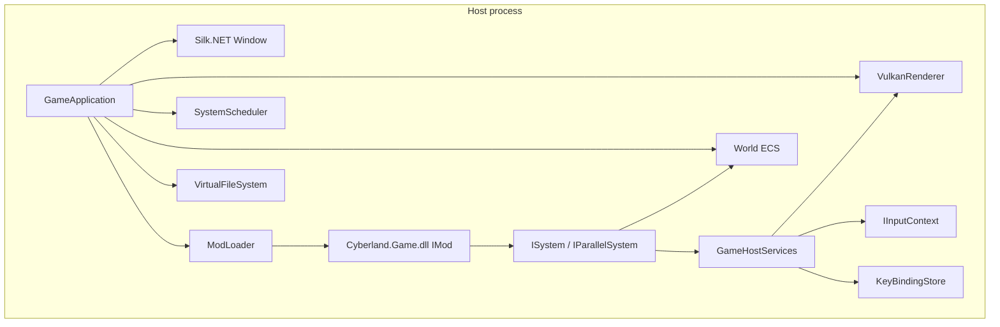

# Cyberland

Cyberland is a **cyberpunk 2D single-player RPG** built in C# on **.NET 8**. The codebase separates a reusable **engine**, a thin **host** executable, and **gameplay delivered as mods** (including the shipped base game). Rendering uses **Vulkan** (via Silk.NET); audio uses **OpenAL**.

Design goals: **small footprint**, **predictable load**, and **scaling from integrated GPUs to modern hardware**—see `.cursor/rules/cyberland-design-goals.mdc` for detail.

---

## Requirements

| Requirement | Notes |
|-------------|--------|
| **.NET 8 SDK** | Required to build and run. |
| **Vulkan 1.x + a working driver** | The host clears and draws a simple sprite; init failures show a user-facing message instead of crashing silently. |
| **Windows** | Primary target; input and error UI are written with that in mind (other platforms may work where Silk.NET + Vulkan do). |

---

## Quick start

From the repository root:

```powershell
dotnet build Cyberland.sln -c Debug
dotnet run --project src/Cyberland.Host/Cyberland.Host.csproj -c Debug
```

Or use the helper script:

```powershell
.\scripts\Run-Cyberland.ps1
.\scripts\Run-Cyberland.ps1 -Watch   # dotnet watch run
```

**Visual Studio Code:** default build task builds the solution; **Run** / **Watch** tasks run the host; launch configuration **Cyberland.Host** debugs the staged output (working directory is the host’s `bin` folder so `Mods/` resolves next to the executable).

After **Cyberland.Host** builds, the base mod is **staged** to:

`src/Cyberland.Host/bin/<Configuration>/net8.0/Mods/Cyberland.Game/`

That folder must contain `Cyberland.Game.dll`, `manifest.json`, and `Content/` when you run the host—`Cyberland.Host.csproj` copies them on build.

---

## Testing (engine)

The **`Cyberland.Engine.Tests`** project targets **`Cyberland.Engine`** only (not the host, mods, or GPU paths). It enforces **100% line coverage** on that assembly via **coverlet**.

```powershell
dotnet test tests/Cyberland.Engine.Tests/Cyberland.Engine.Tests.csproj -c Debug /p:CollectCoverage=true
```

Coverage outputs **`coverage.cobertura.xml`** next to the test project output (ignored by git).

Types that require a real **window**, **Vulkan**, **OpenAL**, or **Win32 MessageBox** are marked **`[ExcludeFromCodeCoverage]`** (`VulkanRenderer`, `GameApplication`, `OpenALAudioDevice`, parts of `GlslSpirvCompiler`, `UserMessageDialog.ShowError`). When you change those, add or extend **manual / integration** checks; keep pure logic testable in isolation.

---

## Repository layout

```
Cyberland.sln
Directory.Build.props          # Shared SDK / language settings
tests/
  Cyberland.Engine.Tests/      # xUnit + coverlet (100% line coverage on Cyberland.Engine)
  Cyberland.TestMod/           # Minimal IMod assembly used by ModLoader tests
src/
  Cyberland.Host/              # Executable: references Engine + Cyberland.Game (build)
  Cyberland.Engine/            # Engine library (ECS, Vulkan, input, mods, assets, …)
mods/
  Cyberland.Game/              # Base game mod (IMod, systems, components, Content/)
scripts/
  Run-Cyberland.ps1
.vscode/
  tasks.json, launch.json
.cursor/rules/                 # Optional agent / team conventions
```

| Project | Role |
|---------|------|
| **Cyberland.Host** | Entry point (`Program.cs` → `GameApplication`). Builds and stages `mods/Cyberland.Game` into `$(OutDir)Mods/Cyberland.Game/`. |
| **Cyberland.Engine** | All shared runtime: windowing, Vulkan renderer, ECS, task scheduler, virtual FS, assets, localization, OpenAL, mod loader, `GameHostServices`. |
| **Cyberland.Game** | Class library compiled to `Cyberland.Game.dll`. Not run directly; loaded by the host from the staged mod folder. |

---

## High-level architecture



1. **Host** creates the window, graphics, input, keybindings, ECS world, scheduler, and VFS, then calls **`ModLoader.LoadAll`** on `AppContext.BaseDirectory/Mods`.
2. Each mod’s **`IMod.OnLoad`** receives a **`ModLoadContext`**: world, scheduler, localization, VFS, and **`Host`** (`GameHostServices`).
3. Mods **register systems** on the scheduler and optionally spawn entities, mount extra paths, etc.
4. Every frame, **`GameApplication`** runs **`SystemScheduler.RunFrame(world, dt)`** (sequential systems, then parallel systems), handles **host-only** input (e.g. Escape → exit), and **presents** the swapchain.

**Rule of thumb:** *If it is gameplay, it belongs in a mod (or a new mod assembly), not in `GameApplication`.*

---

## Engine subsystems (Cyberland.Engine)

### ECS (`Core/Ecs`)

- **`World`** — entity creation/destruction, **`Components<T>()`** stores per component type.
- **`ComponentStore<T>`** — dense storage, **`GetOrAdd`**, **`AsSpan()`** for hot loops.
- **`EntityId`** — opaque id from **`EntityRegistry`**.

Components are **`struct`** types; define them in your mod assembly (see `Velocity` in `Cyberland.Game`).

### Task scheduler (`Core/Tasks`)

- **`SystemScheduler`** — registers **`ISystem`** (main thread, deterministic order) and **`IParallelSystem`** (runs after all sequential systems, with **`ParallelOptions`** from **`ParallelismSettings`**).
- **`ParallelismSettings.MaxConcurrency`** — `0` means use all logical processors.

Frame order:

1. Every **`ISystem.OnUpdate(world, deltaSeconds)`** in registration order.
2. Every **`IParallelSystem.OnParallelUpdate(world, parallelOptions)`** in registration order.

### Rendering (`Rendering/`)

- **`VulkanRenderer`** — swapchain, render pass, pipeline, indexed quad, push constants for sprite position/size in **pixel space** after conversion from **world space** via **`SetSpriteWorld`**.
- **`WorldScreenSpace`** — **world** (origin bottom-left, +Y up) vs **screen / framebuffer** (top-left, +Y down). **`SetSpriteWorld`** applies **`WorldCenterToScreenPixel`** inside the renderer—gameplay should stay in world space and call **`SetSpriteWorld`**, not hand-convert in multiple places.

### Input (`Input/`)

- **`KeyBindingStore`** — maps action ids (`move_up`, `move_left`, …) to **`Silk.NET.Input.Key`**, loaded from `keybindings.json` under the app base directory.

### Assets (`Assets/`)

- **`VirtualFileSystem`** — ordered mount points; **later mounts override earlier** (mod content over base).
- **`AssetManager`** — async **`LoadBytesAsync`**, **`LoadTextAsync`**, **`LoadJsonAsync`**, streaming **`OpenReadOrThrow`**.

### Localization (`Localization/`)

- **`LocalizationManager`** — merged key → string tables (JSON), culture fallback.
- Mods merge strings through the load pipeline / your own loads as needed.

### Audio (`Audio/`)

- **`OpenALAudioDevice`** — optional; host continues without audio if OpenAL is missing.

### Modding (`Modding/`)

- **`IMod`** — **`OnLoad(ModLoadContext)`**, **`OnUnload()`**.
- **`ModManifest`** — id, version, **`entryAssembly`**, **`contentRoot`**, **`loadOrder`** (see `manifest.json`).
- **`ModLoader`** — discovers `Mods/*/manifest.json`, mounts content, loads **`entryAssembly`**, finds one concrete **`IMod`**, invokes **`OnLoad`**.

### Hosting (`Hosting/`)

- **`GameHostServices`** — **`KeyBindings`**, **`Renderer`** (**`VulkanRenderer?`**), **`Input`** (**`IInputContext?`**). Populated by **`GameApplication`** after the window and device exist, then passed into **`ModLoadContext`** so mods do not use static globals.

---

## Mod system (convention)

### Folder layout on disk

```
Mods/
  Cyberland.Game/
    manifest.json
    Cyberland.Game.dll    # copied by host build
    Content/              # optional; mounted to VFS
```

### `manifest.json`

Example (see `mods/Cyberland.Game/manifest.json`):

- **`id`** — stable string id.
- **`entryAssembly`** — DLL name containing an **`IMod`** implementation.
- **`contentRoot`** — relative folder mounted for this mod (often `Content`).
- **`loadOrder`** — lower runs earlier (manifests sorted by load order, then id).

### `IMod` implementation

- Ship a **public non-abstract class** implementing **`IMod`** (the loader picks the first exported type assignable to **`IMod`**).
- **`OnLoad`**: register systems, spawn entities, merge localization, call **`context.MountDefaultContent()`** if you rely on `Content/` under the mod folder.

### `GameHostServices` (via `context.Host`)

| Member | Use |
|--------|-----|
| **`KeyBindings`** | **`IsDown(keyboard, "move_up")`** etc. |
| **`Input`** | Raw **`IKeyboard`** / mice if needed. |
| **`Renderer`** | **`SwapchainPixelSize`**, **`SetSpriteWorld`** for the built-in sprite demo. |

The host sets **`Renderer`** and **`Input`** only after successful window/input setup; systems should null-check when relevant.

---

## Developing new game systems

### 1. Prefer a system in the mod, not the host

Add logic under **`mods/Cyberland.Game`** (or a **new** mod project + `manifest.json` + stage it like the base game).

### 2. Define data as components

```csharp
namespace Cyberland.Game;

public struct MyComponent
{
    public float Value;
}
```

Use **`world.Components<MyComponent>().GetOrAdd(entity)`** (or **`TryGet`**) to associate state with entities.

### 3. Implement `ISystem` and/or `IParallelSystem`

- **`ISystem`** — single-threaded; use for input, gameplay ordering, talking to **`GameHostServices`**, or anything that must not race the ECS stores without care.
- **`IParallelSystem`** — use for CPU-heavy work over **`ComponentStore<T>.AsSpan()`**; follow the pattern in **`DemoVelocityDampSystem`** (copy/rent/write back if you cannot share spans safely across **`Parallel.For`**).

### 4. Register in `BaseGameMod.OnLoad` (or your mod’s `OnLoad`)

```csharp
context.Scheduler.Register(new MySystem(context.Host));
```

Registration order is the run order within each category (sequential vs parallel).

### 5. Use the ECS world from context

```csharp
var id = context.World.CreateEntity();
ref var c = ref context.World.Components<MyComponent>().GetOrAdd(id);
c = new MyComponent { Value = 1f };
```

### 6. Input and rendering

- Read actions through **`context.Host.KeyBindings`** and **`context.Host.Input`**.
- For the current sprite API, update position in **world space** and call **`context.Host.Renderer?.SetSpriteWorld(x, y, halfExtent)`** once per frame from your system when appropriate.

### 7. Assets and localization

- Resolve paths against the **`VirtualFileSystem`** (mounts include mod **`Content/`** roots in load order).
- Use **`AssetManager`** with the same VFS instance the host constructed (passed through localization/bootstrap as in **`GameApplication`**).

### 8. New mod assembly (optional)

1. Add a project under **`mods/YourMod/`** referencing **`Cyberland.Engine`**.
2. Implement **`IMod`**.
3. Add **`manifest.json`**.
4. Reference the mod from **`Cyberland.Host.csproj`** and extend the **`StageBaseMod`**-style **Copy** target (or duplicate it) so **`Mods/YourMod/`** is populated in the output directory.

---

## Reference examples in this repo

| Example | Location | Shows |
|---------|----------|--------|
| Base mod entry | `mods/Cyberland.Game/BaseGameMod.cs` | `IMod`, entity spawn, **`Register`** |
| Sequential + input + renderer | `mods/Cyberland.Game/DemoSpriteMoveSystem.cs` | **`ISystem`**, **`GameHostServices`**, **`SetSpriteWorld`** |
| Parallel ECS | `mods/Cyberland.Game/DemoVelocityDampSystem.cs` | **`IParallelSystem`**, **`Velocity`**, scratch buffer pattern |
| Host bootstrap | `src/Cyberland.Engine/GameApplication.cs` | Lifecycle, **`LoadAll`**, menu key |

---

## Configuration

- **`keybindings.json`** — lives next to the host executable (see **`KeyBindingStore.LoadDefaults`** for action ids). First run creates the file if missing.

---

## Troubleshooting

| Issue | Suggestion |
|-------|------------|
| **Vulkan / GPU errors on startup** | Update GPU drivers; ensure Vulkan is supported. The engine surfaces a message via **`UserMessageDialog`** / **`GraphicsInitializationException`**. |
| **Mod not loading** | Check **`Mods/<Id>/manifest.json`**, **`entryAssembly`** name, and that the DLL is staged next to **`manifest.json`**. |
| **Empty or missing content** | Confirm **`contentRoot`** exists and **`ModLoader`** mount order; later mods override earlier paths for the same relative path. |

---

## Further reading (in-repo)

- **`.cursor/rules/cyberland-mod-host-architecture.mdc`** — host vs mod boundaries and checklists.
- **`.cursor/rules/cyberland-world-screen-space.mdc`** — world vs screen Y conventions.
- **`.cursor/rules/cyberland-code-style.mdc`** — comments and readability expectations.

---

## License

*Add your license here if applicable.*
